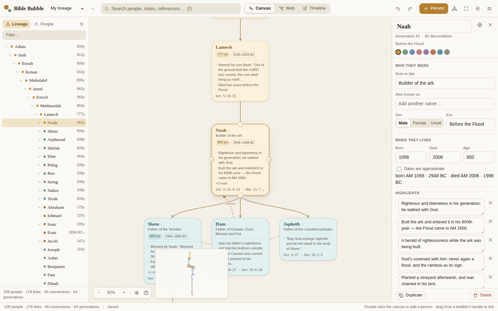
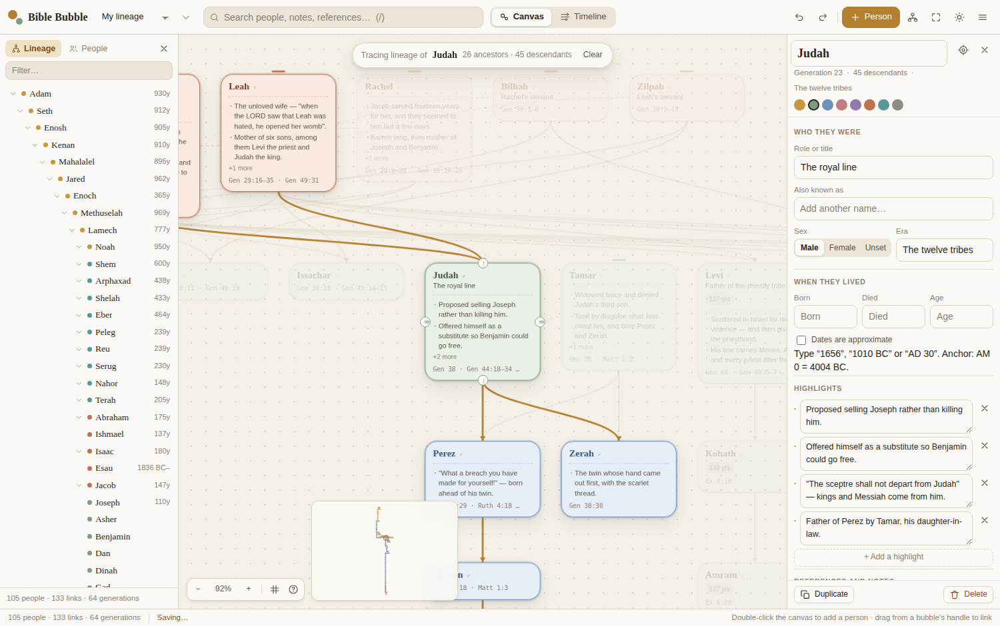
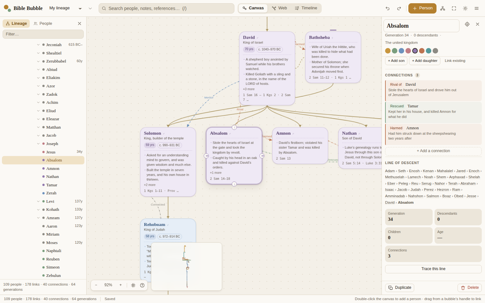
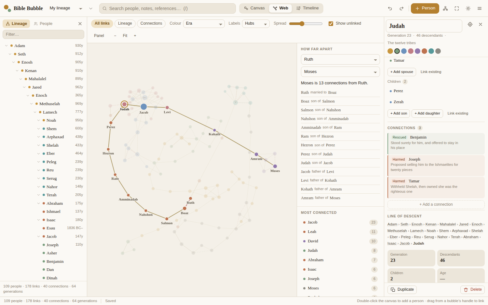
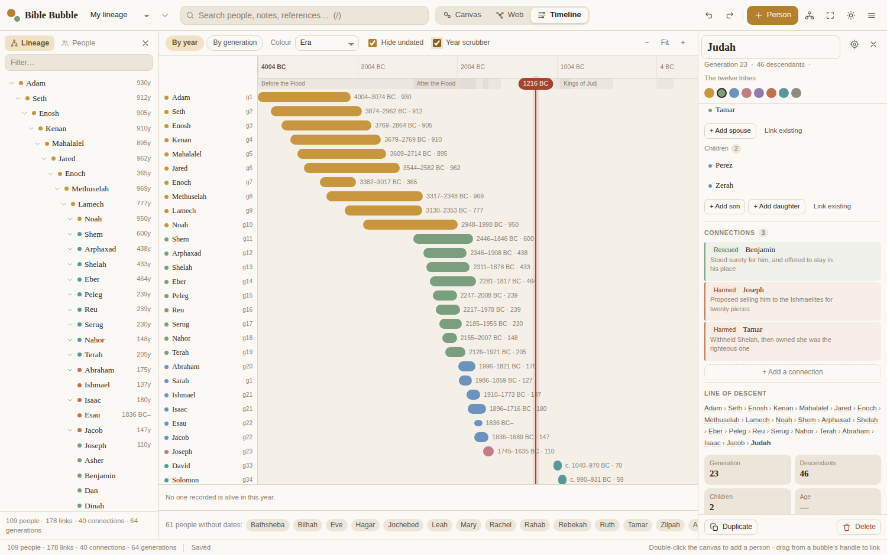
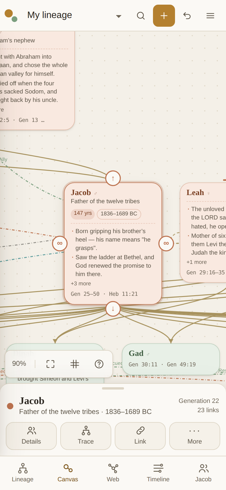
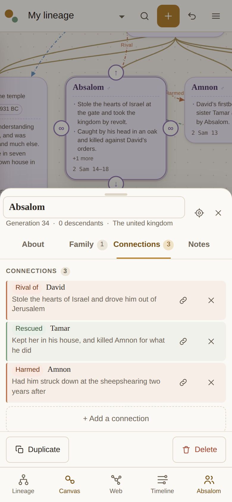
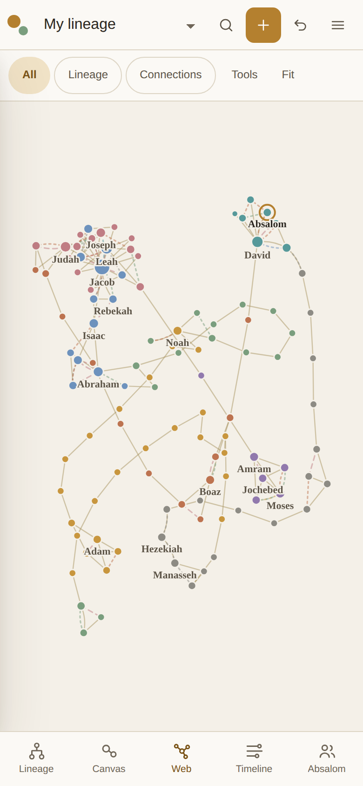
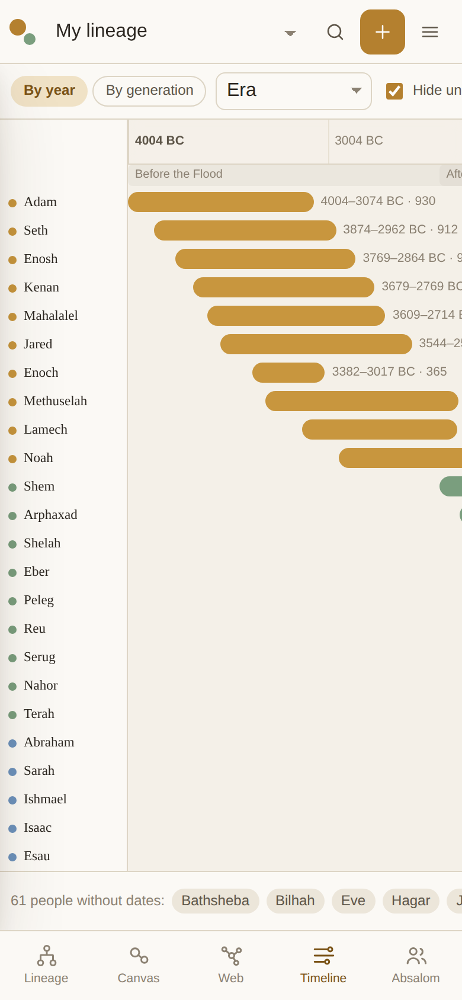
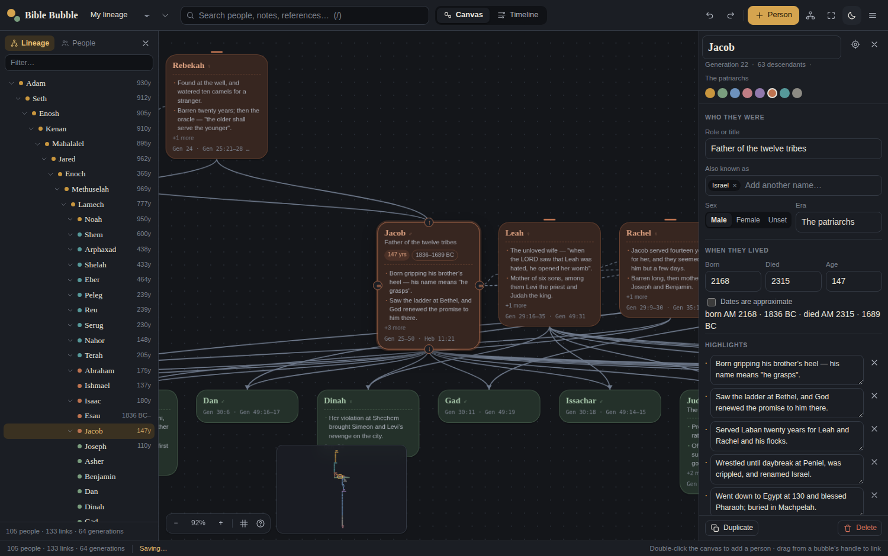

# Bible Bubble

An infinite canvas for tracking **who came from who**.

Make a bubble for a person, write down their age, their references and what they
were known for, then link them to their sons and daughters. Not every tie is a
bloodline, so you can also record the ones that aren't — who taught whom, who
fought whom, who kept covenant with whom. The line grows as you go, and at any
point you can trace a name back to its root, drop the whole board onto one
timeline to see which lives overlapped, or open the **web** and watch the whole
board as one graph of who touched whose life.

Built as a personal note-taking and memory device: everything you write stays in
your own browser, and the whole app is a handful of static files with no build
step, no dependencies and no account.



---

## Try it

**[ilyakarakotov.github.io/bible-bubble](https://ilyakarakotov.github.io/bible-bubble/)**

Or run it locally — **open `index.html`.** That is the whole install: clone or
download the repo and double-click the file, or serve the folder:

```bash
git clone https://github.com/ilyakarakotov/bible-bubble.git
cd bible-bubble
python3 -m http.server 8000   # then open http://localhost:8000
```

Hosting it yourself takes one dropdown and no build step: **Settings → Pages →
Source: Deploy from a branch → `main` → `/ (root)` → Save**. GitHub then serves
the files as they are and re-publishes on every push.

On first run it offers to start you from **Adam** with 109 people already filled
in — the line down to Jesus, with ages, dates, scripture references and
highlights, plus 40 recorded connections that are not lineage — or to hand you an
empty canvas.

---

## What it does

### The canvas
Pan by dragging, zoom with the wheel, and double-click anywhere to add a person.
Each bubble carries a name, a role, when they lived, scripture references, a list
of highlights and free-form notes.

### Linking a lineage
Hover a bubble and four handles appear. **Drag the ↓ handle onto empty canvas and
you get a new child, already linked and waiting for a name** — that is the fast
way to build a line. Drag a handle onto an existing bubble to link the two
instead. ↑ adds a parent, the side handles add a spouse.

The graph refuses to make anyone their own ancestor, so a mis-drag cannot
silently corrupt the tree.

### Tracing a line
Select someone and hit **T**. Their ancestors and descendants stay lit, everyone
else dims, and the panel shows the chain of descent — `Adam › Seth › Enosh › …` —
with every name clickable.



### Connections that are not lineage
A family tree only holds one kind of relationship, and most of the story is in
the others. Right-click a bubble and choose **Connect to someone…** to record a
tie that is not descent: mentor, rival, ally, prophet to, anointed, in covenant
with, rescued, harmed, kin, met. Each one takes a sentence in your own words and
a reference, and each end reads correctly on its own — Elijah is *mentor of*
Elisha, and on Elisha's card the same link reads *taught by* Elijah.

Connections are drawn on the canvas as bowed, coloured arcs so they never get
confused with lineage, they are listed on each person's card, they turn up in
search (look for `covenant` and you get everyone who kept one), and they travel
with your Markdown and CSV exports.



### The web
The third view is the whole board at once: a circle for every person, a line for
every link, arranged by a force simulation that you can pull about with a finger
or a mouse. **A person's circle grows with the number of connections they have**,
so the hubs of a board show themselves without being told.

Hover anyone to light up their neighbours and dim the rest. Filter to lineage
only, or to connections only, and watch the shape change. Colour by era, by
generation, by how many links a person carries, or by the colour you gave the
bubble on the canvas. And two questions the other views cannot answer sit in
the side panel: **who is most connected**, and **how far apart are these two** —
pick any pair and it counts the steps through every kind of relationship and
shows you the chain, each one named.



### The timeline
Every life on one axis. Because Genesis gives exact ages, the antediluvian
staircase and the collapse in lifespans after the Flood are visible at a glance.

Turn on the **year scrubber** and drag it to ask *who was alive in this year* —
the answer, with each person's age at that moment, appears along the bottom. It
is how you find out that Shem was 459 when Abraham was 9, and that Methuselah
died in the very year of the Flood.



### On a phone
The whole thing works one-handed. A bottom bar carries the five places you go —
**Lineage**, **Canvas**, **Web**, **Timeline**, and **Details** (which shows the
selected person's name, so you always know what you have got hold of).

Tap a bubble to select it; its link handles grow to finger size. Press and hold
for the same menu a right-click gives on a desktop. Pinch to zoom, drag to pan,
double-tap empty canvas to add someone. Details opens as a sheet over the
canvas — flick it down to dismiss — so the bubble you are editing stays in view.

<p align="center">
  
  
  
  
</p>

### Everything else
Multiple boards, full undo/redo, search across names, notes, references and
connections, a lineage outline in the sidebar, a tidy auto-layout that arranges
the whole board into generations, light and dark themes, and export to JSON,
Markdown or CSV. The layout adapts from a phone up to a wide desktop, and every
control is sized for a finger on touch devices.



---

## Keyboard

| | |
|---|---|
| `N` | New person |
| `T` | Trace the selected line |
| `L` | Tidy into generations |
| `F` | Fit everything on screen |
| `0` | Back to the head of the line |
| `G` | Toggle the grid |
| `/` | Search |
| `1` `2` `3` | Canvas / web / timeline |
| `⌘Z` `⇧⌘Z` | Undo / redo |
| `⌘A` `⌘D` | Select all / duplicate |
| `Delete` | Remove the selection |
| `?` | All shortcuts |

Shift-drag marquee-selects. Space-drag pans while the cursor is over bubbles.

---

## Your notes stay yours

Boards are saved to `localStorage` in your browser. Nothing is uploaded, there is
no server and no account. That also means **clearing your browser data clears
your boards**, so use *Export as JSON* from the ☰ menu to back one up or move it
to another machine. Markdown export gives you the whole lineage as an indented
outline you can paste into any notes app.

---

## About the dates

Years are stored as **AM** — years from creation — because Genesis 5 and 11 give
the early chain exactly: each father's age when his son was born, and his age at
death. That fixes every date from Adam to Abraham relative to one another, and
those figures are used verbatim.

Everything after Abraham is marked *approximate* and rests on the traditional
anchor of **AM 0 = 4004 BC**. The kings of Judah are dated from their own
notices — "X years old when he began to reign, and he reigned Y years". Where
Matthew's genealogy telescopes generations (Joram to Uzziah, Josiah to Jeconiah),
the omitted kings are included as real people, with a note on the bubble saying so.

The anchor is a setting, not a doctrine: change it under **☰ → Board settings**
(3760 BC for the Hebrew calendar, or anything you like) and every date re-reads
without the stored years moving. Every figure in the starter board is editable —
it is a starting point, not a reference work.

---

## Layout

```
index.html          markup and the icon sprite
css/app.css         the main stylesheet, themed with custom properties
css/web.css         styles for the web view
js/util.js          helpers, the palette, year parsing and formatting
js/store.js         document model, validation, undo history, localStorage
js/seed.js          the Adam-to-Jesus starter board
js/lineage.js       graph queries, degrees, paths and the generational layout
js/canvas.js        viewport, bubbles, links, dragging, minimap
js/inspector.js     the detail and editing panel
js/timeline.js      the timeline and the year scrubber
js/web.js           the force-directed web of connections
js/sidebar.js       lineage outline and people list
js/io.js            JSON / Markdown / CSV
js/app.js           toolbar, menus, search, shortcuts
test/smoke.js       end-to-end browser test
test/touch.js       the same, on a phone-sized screen with touch
```

Plain ES5-compatible scripts on a `BB` namespace — no bundler, no framework, no
network requests at runtime.

---

## Tests

An end-to-end test drives the real app in a headless browser and fails on any
console error:

```bash
npm install --no-save playwright
node test/smoke.js          # HEADED=1 to watch it
node test/touch.js          # the same app at 390x844, with a finger
```

`smoke.js` covers loading the starter board, search, tracing, the timeline and
scrubber, building a line by dragging handles, cycle refusal, editing that
survives a reload, the auto-layout leaving no overlaps, board switching, import
sanitising malformed files, and the connections and web view — that every
connection names two real people and reads correctly from both ends, that the
same pair can hold two kinds of connection but not two of a kind, that the web
actually paints, that the most-connected list agrees with the graph, and that
the hop count between two people is real.

`touch.js` drives the phone layout: the bottom bar, the sheets, finger-sized
handles, long-press, pinch, double-tap, and every view without the page ever
scrolling sideways.

---

## Licence

MIT — see [LICENSE](LICENSE).
